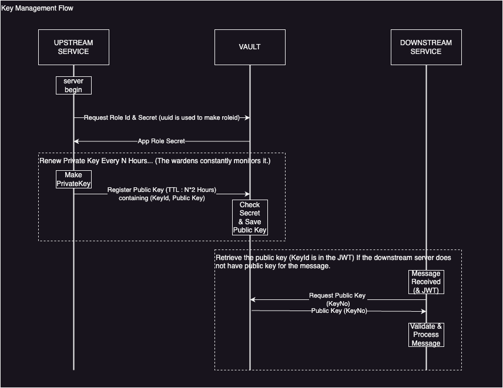

# AikusoniTradeSystem 문서

- 이 문서는 설계 문서입니다.
- :construction: 아직 작업 중인 프로젝트이므로, 미구현된 부분이 있고, 중간중간 내용이 변경될 수 있습니다.

## 목차

- [소개](#소개)
- [프로젝트 개요](#프로젝트-개요)
- [기능 개요](#기능-개요)
- [시스템 아키텍처](#시스템-아키텍처)
- [배포 체인 구성](#배포-체인-구성)
- [브랜치 전략](#브랜치-전략)
- [키 관리 전략](#키-관리-전략)
- [스텁](#스텁)
    - [도커 컴포즈를 사용한 퀵 런처](#도커-컴포즈를-사용한-퀵-런처)
- [시스템 구성요소 목록](#시스템-구성요소-목록)
    - [프론트엔드](#프론트엔드)
    - [백엔드](#백엔드)
    - [데이터베이스](#데이터베이스)
    - [라이브러리](#라이브러리)
    - [기타](#기타)
- [컨벤션](./convention/convention.md)
- [도커 허브 링크](#도커-허브-링크)
- [구현 고려 요소들](./details/future-features.md)

## 소개
AikusoniTradeSystem 프로젝트는 여러 웹 개발 기술을 연습하고 학습하기 위한 개인 프로젝트입니다. \
실사용 목적이 아니며 개인적인 학습과 실험을 위한 프로젝트입니다. \
이 문서에서는 프로젝트의 개요와 각 구성 요소에 대해 설명합니다.

## 프로젝트 개요
AikusoniTradeSystem은 게임내 아이템 경매장을 구현하기 위한 플랫폼입니다. \
이 시스템은 여러 개의 작은 서비스로 구성되어 있으며, 각각의 서비스는 플랫폼의 특정 부분을 처리합니다. \
관리를 용이하게 하기 위해 이런 구조를 선택했습니다. 

## 간단 실행법
이 프로젝트는 docker-compose 를 사용해 한번에 실행 할 수 있는 샘플 레포지토리를 제공하고 있습니다. \
[ats-quick-launcher](https://github.com/AikusoniTradeSystem/ats-quick-launcher)를 참조해주세요.

## 기능 개요 (예상)
각 기능에 대한 상세 시나리오는 [상세 시나리오](./details/scenario.md)문서에 작성되어 있습니다.
- 회원 가입 및 로그인
- 관리자의 아이템 정보 관리
- 인벤토리를 가진 게임 캐릭터 생성 / 삭제
- 캐릭터의 아이템 루팅 처리
- 계정 창고 및 캐릭터 인벤토리 기능
- 경매장을 통한 아이템 거래
- 아이템 거래 통계

## 시스템 아키텍처

### 도안 (계획)
[](./imgs/system-architecture.svg)

### 설명
- 프론트엔드는 마이크로 프론트엔드 방식으로 구성, 필요한 경우 랜딩 페이지를 위한 SSR 웹서버 별도 구성
- 백엔드는 요청을 받기위한 API 서버들과, 응답을 위한 응답 서버, 거래처리 등을 수행하기 위한 데몬, 이벤트 브로커로 구성
- 인증 서버를 따로 분리하고 Nginx의 Auth Request 플러그인으로 인증 처리를 담당. 인증서버는 인증된 사용자의 요청에 JSON 토큰을 삽입해 검증된 사용자임을 각 서비스에서 알 수 있도록 만든다.
- 내부망의 서비스 끼리도 검증이 필요하니 API호출 혹은 메시지 전송시에도 증명을 위한 토큰을 넣어 호출한다.

## 배포 체인 구성

### 도안 (계획)
[](./imgs/deployment-chain.svg)

### 설명
- 라이브러리 레포가 릴리즈되면 GitHub Actions를 통해 Github Package Repository에 등록
- 서비스 레포(프론트엔드 포함)가 릴리즈되면 GitHub Actions를 사용해 도커 이미지로 빌드해서 도커 허브(혹은 Docker Private Repository)에 등록
- 스크립트 레포가 릴리즈되면 GitHub Actions를 통해 오케스트레이션 툴이 클러스터의 인스턴스들을 도커 허브에 등록된 이미지로 업데이트
- develop 브랜치에 배포된 앱은 develop 태그를 붙여 배포되고, release된 앱은 latest 태그를 붙여 배포됩니다.
- 빌드 스크립트의 캐시 이슈가 있을 수 있기 때문에 패키지의 경우에는 따로 develop 버전이 없습니다.

## 브랜치 전략

### 도안
:construction:
- 기본적인 기능 개발이 완료되면 [git flow](https://techblog.woowahan.com/2553/) 또는 [github flow](https://docs.github.com/ko/get-started/using-github/github-flow)와 유사한 형태로 진행합니다.

### 설명
:construction:
- 기본적인 기능 개발이 완료되면 [git flow](https://techblog.woowahan.com/2553/) 또는 [github flow](https://docs.github.com/ko/get-started/using-github/github-flow)와 유사한 형태로 진행합니다.

## 키 관리 전략

### 도안


### 설명
- 각 서비스는 서비스 인스턴스가 켜질 때 자신의 별명이 될 UUID를 생성하고, 이 UUID를 사용해 Vault에서 secret을 생성해온다.
- 각 서비스는 일정 주기로 비공개키를 생성해 메모리에 저장하고, 서버 생성시 사용된 UUID와 Secret으로 Vault에 TTL을 걸어 공개키를 배포한다.
- 각 서비스는 JWT를 발행할 때 자신의 비공개키를 사용해 서명한다.
- 메시지를 받은 서비스는 JWT의 유효성을 검증할 때 자신의 메모리에 메시지를 검증할 공개키가 없으면, Vault에서 공개키를 가져와 검증한다.
- Vault에 등록되는 UUID와 Secret, 공개키는 보안 관제팀에 의해 계속 모니터링 되어야 한다.
- (추가 고려사항) Vault에 UUID와 Secret을 등록 할 때, 보안 관제팀이 관련 서비스 담당자한테 연락 후 등록하는 절차를 넣는 방식도 고려 가능하다. 

## 개발환경 퀵 런처
```
개발 환경 구축을 쉽게 하기 위해 실행용 소스를 제공합니다.
```
### 도커 컴포즈를 사용한 퀵 런처
- 레포: [ats-docker-compose-launcher](https://github.com/AikusoniTradeSystem/ats-docker-compose-launcher)
- 기술: docker-compose, shell script
- 설명: 도커 컴포즈를 사용해 프로젝트의 모든 서비스를 한번에 실행할 수 있도록 구성되어 있습니다. 이 레포지토리를 참조하면 도커 컴포즈를 사용해 도커 클러스터에 서비스를 등록 할 수 있습니다.

## 시스템 주요 구성요소 목록

### 프론트엔드
마이크로 프론트엔드 방식

#### 랜딩 페이지 (작업중)
- 레포: [ats-landing](https://github.com/AikusoniTradeSystem/ats-landing)
- 기술: React
- 설명: 프로젝트의 랜딩 페이지, 회원가입/로그인 등의 페이지 제공을 담당한다.

### 백엔드

#### 회원 서버 (작업전🚧)

#### 토큰 로그인 서버 (작업전🚧)

#### 토큰 검증 서버 (작업전🚧)

#### 세션 인증 서버
- 레포: [session-auth-server](https://github.com/AikusoniTradeSystem/session-auth-server)
- 서버: Spring Boot (Spring MVC)
- 설명: 회원가입/로그인/권한관리/인증 및 세션을 관리합니다. Redis를 사용해 세션 정보를 클러스터링 합니다.


#### 테스트 서버 1
- 레포: [test-server-spring](https://github.com/AikusoniTradeSystem/test-server-spring)
- 서버: Spring Boot (Spring MVC)
- 설명: 인가 기능 테스트를 진행하기 위한 Spring Boot 서버입니다.

### 라이브러리
```
공통적으로 사용되는 모듈의 경우 GitHub Package Repository를 통해 배포해서 사용합니다.
(추후 maven central repository에 배포할지도 고려해볼 예정)
```

#### AikusoniTradeSystem 스프링부트 앱용 Core 모듈 (작업중)
- 레포: [ats-spring-core](https://github.com/AikusoniTradeSystem/ats-spring-core)
- 설명: 스프링 부트 애플리케이션에서 공통으로 사용될 Core 모듈 

#### AikusoniTradeSystem 스프링부트 앱용 Web MVC 모듈 (작업중)
- 레포: [ats-spring-mvc-standard](https://github.com/AikusoniTradeSystem/ats-spring-mvc-standard)
- 설명: 스프링 부트 애플리케이션 중 WEB-MVC를 사용하는 서버 애플리케이션에서 사용될 WEB-MVC 표준 모듈

### 기타

#### packages 
- 레포: [packages](https://github.com/AikusoniTradeSystem/packages)
- 설명: GitHub Package Repository를 통해 배포되는 패키지를 등록하기 위한 레포지토리

### 데이터베이스
- DB: DB 정보는 각 도메인에 해당되는 프로젝트에서 관리
- 기술: Postgresql (핵심 데이터용), Redis(세션클러스터링), 또, 게임 아이템 세부 정보 관리를 위해 NoSQL (예: MongoDB)을 고려 중입니다.

## 도커 허브 링크
- [ats-landing](https://hub.docker.com/r/aikusoni/ats-landing)
- [ats-session-auth-server](https://hub.docker.com/r/aikusoni/ats-session-auth-server)
- [ats-test-server-spring](https://hub.docker.com/r/aikusoni/ats-test-server-spring)
